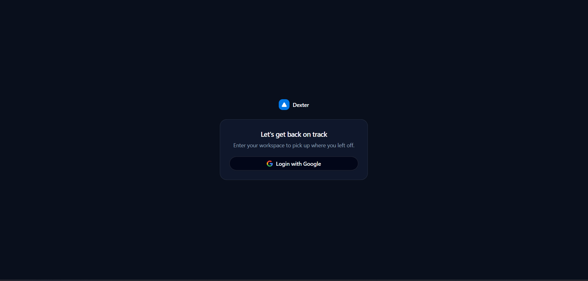
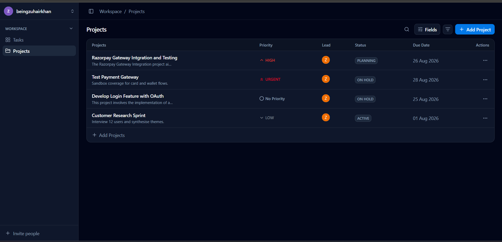
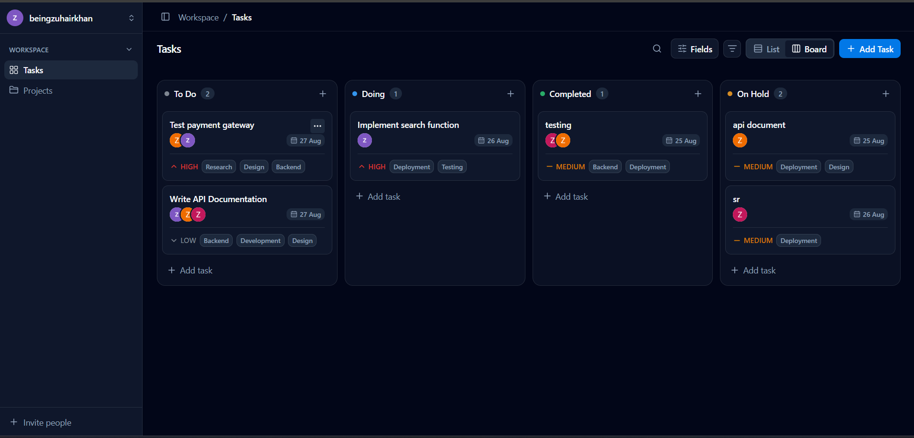
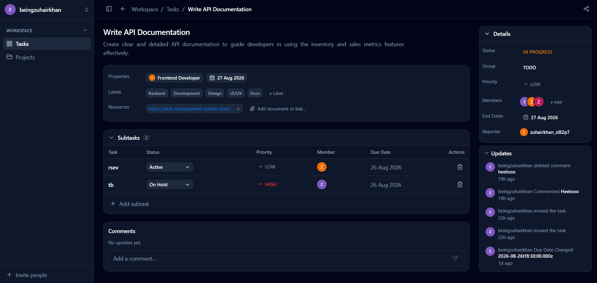
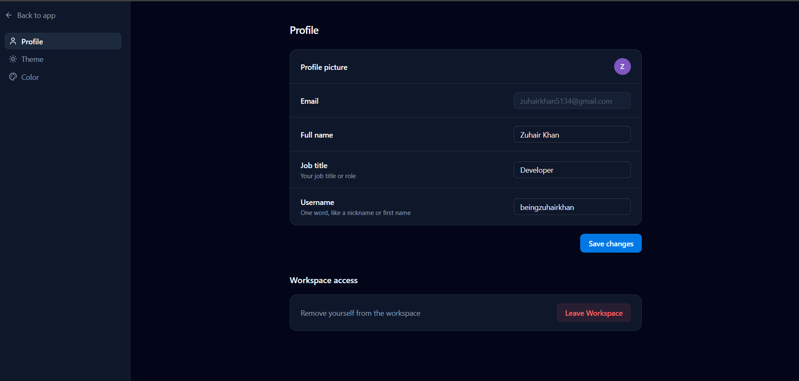

# Task Management System

A full-stack task management application for creating, managing, and tracking tasks.

## Project Links

* Demo: [Google Drive Demo Link](https://drive.google.com/file/d/1_uEiECIsyeHUHyN1HTbQmj803kymmEZZ/view?usp=sharing)
* Frontend: [Frontend Deployed Link](https://task-management-system-lime-two.vercel.app/)
* Backend: [Backend Deployed Link](https://task-management-system-dzpw.onrender.com)

## Tech Stack

### Frontend

* Next.js
* Tailwind CSS
* shadcn/ui

### Backend

* Node.js
* Next.js
* MongoDB
* Redis
* GenAI with Llama model for automatically generating task descriptions
* Brevo for sending emails

### Deployment

* Frontend: Vercel
* Backend: Render

## Project Screenshots

### 1. Login Page

The login page allows users to securely access the task management system.

### 2. Projects Page

The projects page displays all projects available to the user and provides an overview of the projects they are managing.

### 3. Tasks by Project

The task page displays all tasks associated with a specific project using the project ID.

### 4. Task Details

The task details page displays complete information about a specific task using its task ID.

### 5. Settings Page

The settings page allows users to manage their account details and log out of the application.

